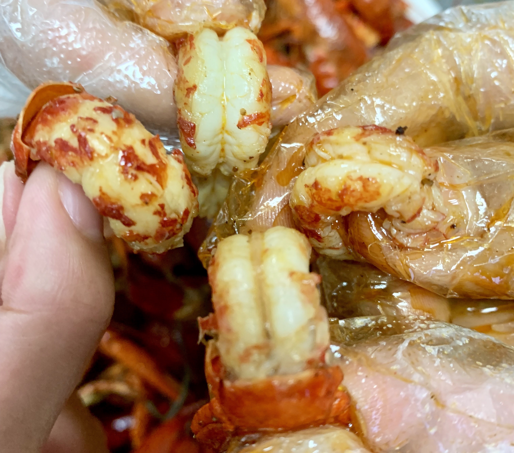

### 最重要的感谢

- 这篇文章能成功的在github上发表，参考了很多网络上的小伙伴的总结，正因为有这样一群人的存在，互联网才能够如此茁壮成长吧。
- 首先我是参考[这篇文章](https://blog.csdn.net/u012168038/article/details/77715439)一步步操作下来的，谢谢你。
- 其次，这篇文章的外观设计使用了Heiswayi Nrird 的[这个作品](http://jekyllthemes.org/themes/thinkspace/),我觉得非常的简约，我很喜欢，谢谢你。

### 为什么我需要仪式感

一提到令人难忘的事，我想你大概会联想到 痛苦、刺激、艰难、兴奋、非常愉悦。能用这些词描绘的事情，我想一定会很难忘，比起那些更加平淡无奇的事。 至少对我来说是这样。

我是个很健忘的人。我不想等我老了以后，大脑一片空白，没有什么事情值得我回味（这件事本身是为了自身的愉悦，是完全利己主义的想法）。

但生活对我来说不总是那么波澜壮阔的，所以我要借鉴生活中遇到的有意思的事务来点缀自己。比如请师弟师妹吃小龙虾可以很平淡，平淡到过一个月就忘记了。但也可以有趣起来，比如用小龙虾碰个杯什么的。我想这样子，我会记得更久吧。

### 为什么现在还没有

